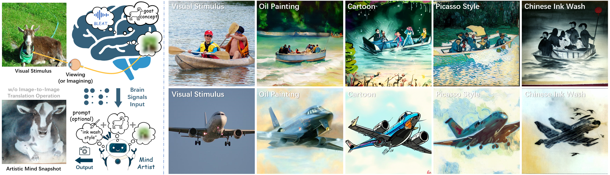
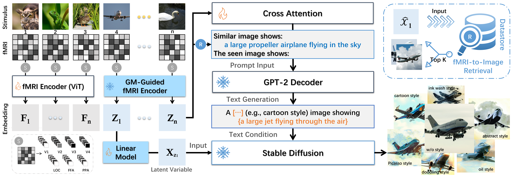
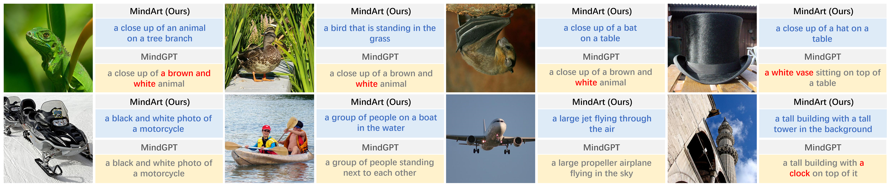

# Mind Artist: Creating Artistic Snapshots with Human Thought
Official Implementation of [MindArt (CVPR2024)](https://openaccess.thecvf.com/content/CVPR2024/html/Chen_Mind_Artist_Creating_Artistic_Snapshots_with_Human_Thought_CVPR_2024_paper.html) in PyTorch



## Overview
> **Abstract**:We introduce Mind Artist (MindArt) a novel and efficient neural decoding architecture to snap artistic photographs from our mind in a controllable manner. Recently progress has been made in image reconstruction with non-invasive brain recordings but it's still difficult to generate realistic images with high semantic fidelity due to the scarcity of data annotations. Unlike previous methods this work casts the neural decoding into optimal transport (OT) and representation decoupling problems. Specifically under discrete OT theory we design a graph matching-guided neural representation learning framework to seek the underlying correspondences between conceptual semantics and neural signals which yields a natural and meaningful self-supervisory task. Moreover the proposed MindArt structured with multiple stand-alone modal branches enables the seamless incorporation of semantic representation into any visual style information thus leaving it to have multi-modal reconstruction and training-free semantic editing capabilities. By doing so the reconstructed images of MindArt have phenomenal realism both in terms of semantics and appearance. We compare our MindArt with leading alternatives and achieve SOTA performance in different decoding tasks. Importantly our approach can directly generate a series of stylized "mind snapshots" w/o extra optimizations which may open up more potential applications.



## Brain2Text


## Brain2Image


## MindArt Code

1) Download DIR dataset and ImageNet dataset

2) Install Stable Diffusion v1.4, and download checkpoint (sd-v1-4.ckpt)

3) Extract CLIP visual representations as well as the faiss index

4) Change Paths in configure.py to match your file locations

5) train the GM-guided fMRI encoder by running GM/matching_learning.py

6) train the fMRI-to-Text stream by running TextReconstruction/brain2text_train.py

7) train the fMRI-to-Image stream by running ridge.py

8) reconstructing image by running diffusion_decoding.py

* Our codebase builds on StableDiffusionReconstruction, SuperGlue, MAE, SMALLCAP, stable-diffusion repositories. We would like to thank the authors.

## Citation
```
@InProceedings{Chen_2024_CVPR,
    author    = {Chen, Jiaxuan and Qi, Yu and Wang, Yueming and Pan, Gang},
    title     = {Mind Artist: Creating Artistic Snapshots with Human Thought},
    booktitle = {Proceedings of the IEEE/CVF Conference on Computer Vision and Pattern Recognition (CVPR)},
    month     = {June},
    year      = {2024},
    pages     = {27207-27217}
}
```
